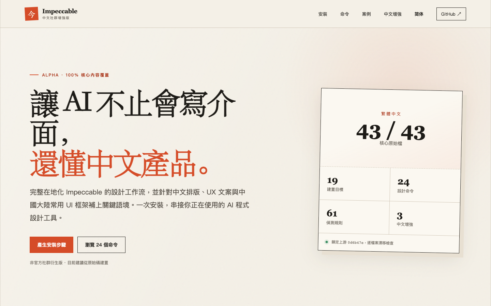

<div align="center">
  
  <h1>Impeccable 中文社群增強版</h1>
  <p><strong>讓 AI 不止會寫介面，還懂中文產品設計。</strong></p>
  <p>完整中文化 Impeccable，並加入中文排版、中文 UX 文案與中國大陸 UI 框架指導。</p>

  [](locales/zh-TW/source-map.json)
  [](scripts/lib/transformers/providers.js)
  [](web/zh-TW/index.html)
  [](LICENSE)

  <p>
    <a href="https://jnmetacode.github.io/impeccable-zh/zh-TW/"><strong>前往繁體中文使用中心</strong></a>
    · <a href="#快速開始">快速開始</a>
    · <a href="docs/CASE-STUDY.zh-TW.md">檢視示範案例</a>
    · <a href="README.zh-CN.md">简体中文</a>
    · <a href="https://github.com/pbakaus/impeccable#readme">English upstream README</a>
  </p>
</div>



> [!IMPORTANT]
> 目前為 Alpha。核心中文內容與建置鏈路已完成，但尚未釋出穩定安裝包，建議固定 Git commit 從原始碼安裝。本專案是社群衍生版，與上游作者不存在官方隸屬或背書關係。

## 為什麼做繁體中文版

通用模型能讀中文，但“能翻譯”不等於“理解中文介面”。真正影響結果的是可執行的產品語境：中文標籤如何換行、行動版觸控目標如何處理、錯誤提示該多直接、Element Plus 與 Ant Design 的預設模式何時應該保留。

| 沒有中文設計上下文 | 使用 Impeccable 中文增強版 |
|---|---|
| 照搬西文行高與字距 | 按中文字型、標點與混排規律檢查 |
| 產生模板化 SaaS 頁面 | 先記錄產品事實，再選擇視覺方向 |
| 忽略中文長文字與框架狀態 | 主動覆蓋溢位、錯誤、空狀態和元件語義 |
| “看起來不錯”但無法複核 | 61 條確定性規則與證據化評審分工 |

## 已經包含什麼

- **43/43 核心原始檔完整中文化**：入口、38 個參考文件和 4 個 Agent 契約。
- **3 項華語產品情境原創增強**：中文排版、中文 UX 文案、中國大陸常用 UI 框架。
- **24 個設計命令**：從 `init`、`shape` 到 `audit`、`polish`、`live`。
- **61 條確定性偵測規則**：無需模型和 API Key 即可執行。
- **19 個建置目標**：Claude Code、Codex、Cursor、Trae 中國版、GitHub Copilot、Gemini CLI 等。
- **上游漂移守衛**：逐檔案記錄 Git blob，上游變化後必須人工複核翻譯。

## 快速開始

需要 Node.js 22.18+；建議安裝 Bun。穩定包釋出前，從原始碼建置：

```bash
git clone https://github.com/jnMetaCode/impeccable-zh.git
cd impeccable-zh
npm install --ignore-scripts
npm run localization:build:zh-TW
```

然後在你的專案根目錄連結所需工具：

```bash
npx impeccable link --source=/path/to/impeccable-zh --providers=claude,codex,cursor
```

重新載入 AI 程式設計工具後執行：

```text
/impeccable init
```

團隊希望隨專案固定版本時，使用 Web 安裝指南產生 Git submodule 步驟：

```bash
npm run web:preview
```

造訪 `http://127.0.0.1:4173/zh-TW/`，或直接開啟[繁體中文使用中心](https://jnmetacode.github.io/impeccable-zh/zh-TW/)。

## 常用命令

| 目標 | 命令 | 作用 |
|---|---|---|
| 建立上下文 | `/impeccable init` | 訪談並寫入長期產品事實 |
| 先規劃再編碼 | `/impeccable shape <功能>` | 形成使用者確認的設計簡報 |
| 設計評審 | `/impeccable critique <頁面>` | 檢查層級、認知負荷與情緒體驗 |
| 技術稽核 | `/impeccable audit <範圍>` | 檢查無障礙、效能、回應式和反模式 |
| 中文排版 | `/impeccable typeset <頁面>` | 改善字型、層級、行高與混排 |
| 多端調整 | `/impeccable adapt <頁面> 行動版` | 處理斷點、流式佈局與觸控目標 |
| 上線精修 | `/impeccable polish <頁面>` | 修復一致性與微觀細節 |

完整命令可在 [Web 使用中心](https://jnmetacode.github.io/impeccable-zh/zh-TW/#commands)搜尋並複製。

## 示範案例

儲存庫提供一個可重現的 Element Plus 中文表單示範：從標籤擁擠、手機密度過高和狀態缺失，逐步經過 `audit → typeset → adapt → polish`，並用明確檢查項驗證結果。

這個案例使用儲存庫測試夾具，不冒充真實客戶專案，也不虛構轉化率資料。檢視[完整案例與重現步驟](docs/CASE-STUDY.zh-TW.md)。

## 中文版架構

```text
英文上游 skill/ ──┐
                  ├─ 臨時合成 ─ 19 個 Provider 發行產物
locales/zh-TW/ ───┤
locales/zh-TW/extensions/ ───┘
```

- 英文 `skill/` 保持為可合併的上游事實源。
- 中文原始檔位於 `locales/zh-TW/`。
- 繁體中文增強內容位於 `locales/zh-TW/extensions/`。
- 建置只在臨時目錄合成中文 Skill，不覆蓋英文原始檔。
- CLI 命令、JSON 欄位、設定鍵和執行時錯誤在 v1 保持英文。

關鍵維護檔案：

- [`upstream-lock.json`](upstream-lock.json)：凍結的上游 commit 與元件版本
- [`locales/zh-TW/source-map.json`](locales/zh-TW/source-map.json)：逐檔案翻譯對映與 blob
- [`locales/zh-TW/glossary.yml`](locales/zh-TW/glossary.yml)：統一術語表
- [`locales/zh-TW/extensions/manifest.json`](locales/zh-TW/extensions/manifest.json)：繁體增強分發位置

## 品質保證

```bash
npm run localization:check
npm run localization:test
npm run localization:sync-audit
npm run localization:build:zh-TW
npm run web:test
npm run web:build
```

目前門禁覆蓋翻譯完整性、上游漂移、19 個 Provider 建置、安裝與更新 E2E、中文行為評測結構、Web 資料一致性和回應式瀏覽器冒煙檢查。模型行為評測不會預設呼叫外部 API；設定方法見 [`tests/localization-evals/README.md`](tests/localization-evals/README.md)。

## 上游同步

翻譯不會因為檔案仍然存在就被視為“最新”。原始檔 blob 變化後，`localization:check` 會失敗；每週稽核 Workflow 會更新一個固定標題的 Issue，等待人工複核，不會自動提交翻譯或改寫基線。

```bash
git fetch upstream main
node scripts/localization/sync-audit.mjs --target=upstream/main --json
```

## 許可證與來源

上游 Impeccable 使用 Apache-2.0。本專案保留上游 LICENSE 與 NOTICE；由 `ai-ui-design` 遷移的內容保留 MIT 來源宣告，詳見 [`NOTICE.md`](NOTICE.md)。

## 目前邊界

- 不重寫或翻譯 Rust CLI 協議。
- 不釋出同名 npm 包替代上游 `impeccable`。
- 不繞過上游二進位制或 bundle 簽名機制。
- 不在缺少評測證據時宣稱中文版效果更好。
